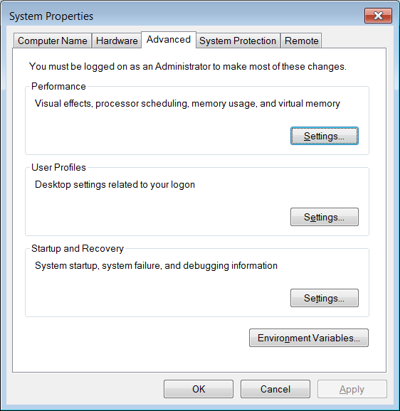
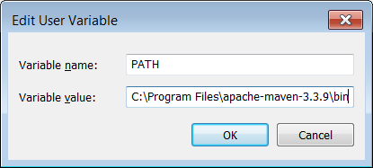
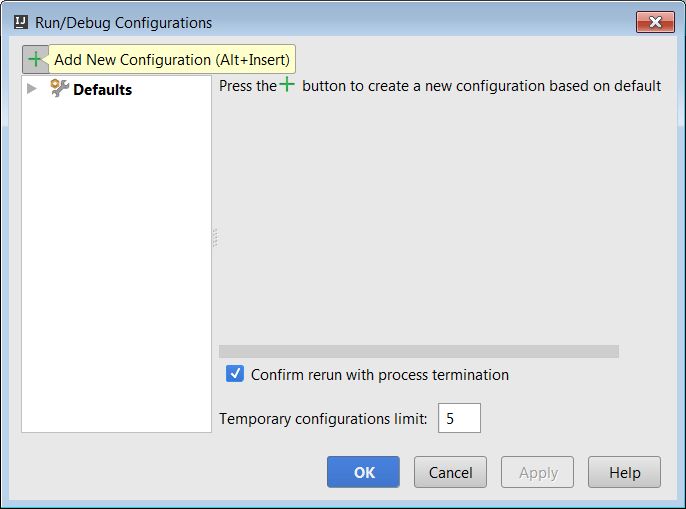
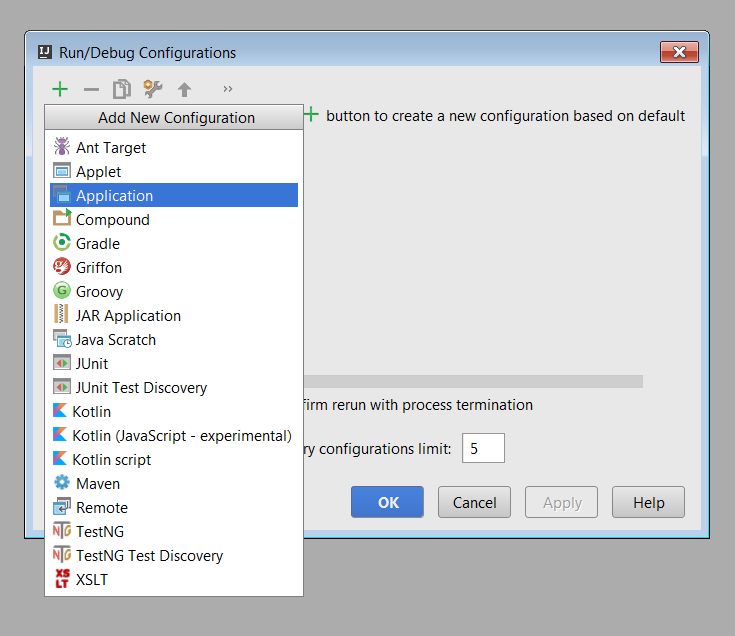
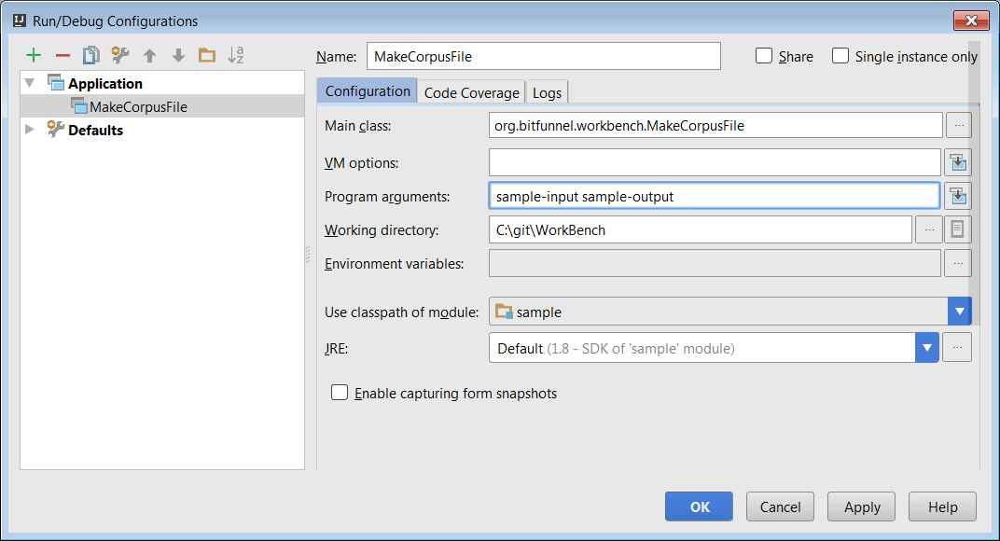
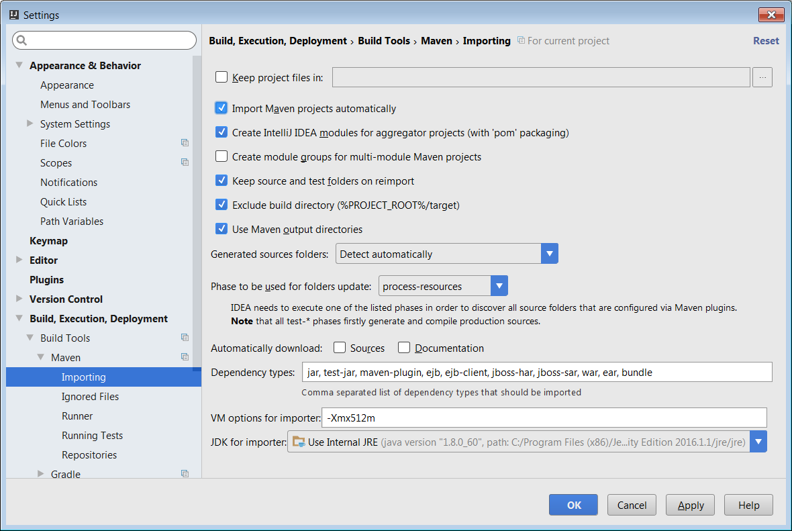

# Corpus Tools

The **org.bitfunnel.workbench** package provides tools for converting
[Wikipedia](https://www.wikipedia.org/)
database dump files into BitFunnel corpus files. We designed BitFunnel corpus
files with the goal of trivial and extremely low overhead parsing.

The conversion process involves parsing the Wikipedia dump files, extracting
each document, removing wiki markup, performing [Lucene](https://lucene.apache.org/) analysis for
tokenization and stemming, and finally generating encoding and writing
the data in BitFunnel format.

While the initial conversion from Wikipedia database dumps to BitFunnel corpus
files may be slow, subsequent experiments with BitFunnel corpus files should be fast and reliable.

The expected workflow is to download a Wikipedia database dump and convert it
once and then use the resulting BitFunnel corpus files many time over.

Instructions for obtaining data and processing it below.

## Obtaining a the Wikipedia Database Dump

1. Obtain a Wikipedia database dump file.  These files are available at
[https://dumps.wikimedia.org/](https://dumps.wikimedia.org/).

1. Click on [Database backup dumps](https://dumps.wikimedia.org/backup-index.html).
The dumps of the English language Wikipedia pages are under [enwiki]
(https://dumps.wikimedia.org/enwiki/). Each folder here corresponds to
a dump on a particular day.

1. The dump folder is organized into sections. Look for a section entitled,
**Articles, templates, media/file descriptions, and primary meta-pages.**
The links here should be of the form enwikie-DATE-parges-articlesN.xml-pXXXpYYY.bz2
where DATE is of the form YYYYMMDD, N is section number, and XXX and YYY
are number specifiying page ranges.

1. Download one of these files and use [7-Zip](http://www.7-zip.org/) or equivalent to decompress.

## Preprocessing the Wikipedia Database Dump

The wikipedia dump is XML data that looks something like

~~~
<mediawiki xmlns="http://www.mediawiki.org/xml/export-0.10/" xmlns:xsi="http://www.w3.org/2001/XMLSchema-instance" xsi:schemaLocation="http://www.mediawiki.org/xml/export-0.10/ http://www.mediawiki.org/xml/export-0.10.xsd" version="0.10" xml:lang="en">
  <siteinfo>
    <sitename>Wikipedia</sitename>
    <dbname>enwiki</dbname>
    <base>https://en.wikipedia.org/wiki/Main_Page</base>
    <generator>MediaWiki 1.27.0-wmf.19</generator>
    <case>first-letter</case>
    <namespaces>
      <namespace key="-2" case="first-letter">Media</namespace>
      <namespace key="-1" case="first-letter">Special</namespace>
      ... many more namespace entries ...
      <namespace key="2600" case="first-letter">Topic</namespace>
    </namespaces>
  </siteinfo>
  <page>
    <revision>
      <title>TITLE</title>
      ... lots of other tags ...
      <text xml:space="preserve">
        ... the wiki markup for the page ...
      </text>
    </revision>
  </page>
  ... lots more pages ...
</mediawiki>
~~~

This data must be preprocessed with an open source program called
[WikiExtractor](https://github.com/attardi/wikiextractor)
before converting to BitFunnel corpus format. The WikiExtractor program
parses the XML dump file, extracts the title, url, curid, text for each
page, and then strips all of the wiki markup tags from the text.

WikiExtractor requires Python 2.7
(note that Python 3 and beyond are not compatible with version 2.7).
To install Python on the mac,
~~~
brew install python
~~~

To install Python on linux,
~~~
sudo apt install python
~~~

On windows, run the Python 2.7.11 [installer](https://www.python.org/downloads/).

You can run WikiExtractor from the command line as follows:
~~~
./WikiExtractor.py input
~~~
where **input** is an uncompressed Wikipedia database dump file.
If you don't supply the "-o" option the output will be written
to the directory ./text.

Note that some versions of WikiExtractor may fail on Windows because of a
bug related to process spawning.
You can work around this bug by using the "-a" flag, but the extraction will be
slower because it will be limited to a single thread.

The output of wikiextractor looks something like

~~~
<doc id="ID" url="https://en.wikipedia.org/wiki?curid=ID" title="TITLE">
  text for this document.
  ... more text ...
</doc>
... more documents ...
~~~

We were able to successfully process
[enwiki-20160407-pages-meta-current1.xml-p000000010p000030303.bz2](https://dumps.wikimedia.org/enwiki/20160407/enwiki-20160407-pages-meta-current1.xml-p000000010p000030303.bz2)
using WikiExtractor [commit 60e40824](https://github.com/attardi/wikiextractor/commit/60e4082440b626465b2df30301ab00c3a04cd79b).

Note that this version of WikiExtractor will not run on Windows
without the "-a" flag because of a bug.

## Building org.bitfunnel.workbench.

Java development requires a JDK ((we used jdk1.8.0_92).
Our package is built with [Maven](https://maven.apache.org/).
(version 3.3.9).
The unit tests are based on [JUnit](http://junit.org/).

### OSX Configuration and Build
Install a JDK. We used Oracle's **Java SE 8u92** which can be
found on their [downloads page](http://www.oracle.com/technetwork/java/javase/downloads/index.html).

If you don't want to manually install the exact version we used, you can take your chances with the version of Java you'll get with homebrew; the following commands worked on 8/9/2016 with 10.11.5 (El Capitan), but there's guarnatee that the build will continue to work with future updates:
~~~
brew update
brew cask install java
~~~

Use homebrew to install Maven:
~~~
% brew install maven
~~~

Build org.bitfunnel.workbench from the command line:
~~~
% mvn package
~~~

### Windows Configuration and Build

Install a JDK. We used Oracle's **Java SE 8u92** which can be
found on their [downloads page](http://www.oracle.com/technetwork/java/javase/downloads/index.html).

Install Maven.

1. Download the Maven [.zip file](https://maven.apache.org/download.cgi).
1. Extract to some location on the machine.
1. Add the extracted folder's bin directory to the PATH.
  1. Open the System Control panel by pressing (Windows + Pause).
  
  1. Choose **Advanced System Settings** on the left.
  
  1. Click **Environment Varables** at the bottom of the dialog.
  
  1. Select the variable called **PATH** and press **Edit...**
  
  1. Add a semicolon (;) to the PATH and then the path to the extracted bin folder.
  
  1. **OK** out of all of the dialogs.
  1. Close and reopen any cmd.exe windows to get the new PATH.
  1. Tip. You can update the path in an open cmd.exe window, for example
     ~~~
     set PATH=%PATH%;C:\C:\Program Files\apache-maven-3.3.9\bin
     ~~~

     This change will only have effect in the current window and only until it is closed.

1. In a similar manner, set the JAVA_HOME to point to your JDK. For example,
   ~~~
   set JAVA_HOME=C:\Program Files\Java\jdk1.8.0_92
   ~~~

Build org.bitfunnel.workbench from the command line:
~~~
% mvn package
~~~

### Linux Configuration and Build

~~~
sudo apt install openjdk-8-jdk python maven
mvn package
~~~

### IntelliJ Configuration and Build

[IntelliJ Community Edition](https://www.jetbrains.com/idea/)
is a fairly lightweight, free IDE for Java.
It has a good debugger, support for Ant, Maven, Gradle, and JUnit, and
it provides a number of nice code browsing and refactoring features.
IntelliJ is available on Linux, OSX, and Windows.

Start IntelliJ. From the welcome screen, select **open**:

Select **pom.xml** and press **OK**.

The project will be imported. Now set up the debug and run configurations by clicking on **Run => Edit Configurations ...**

The click the green **+** in the upper left corner to add a new configuration:

Select **Application**

On the configuration tab, choose a **Name** for the configuration, set the **Main class** field to
org.bitfunnel.workbench.MakeCorpusFile, and set the **Program arguments** to reference your
input and output directories. **OK** out of all of the dialogs.

If you plan to edit the pom.xml file, say to add additional dependencies, it helps to configure
auto import. To do this, go to **File => Settings ...**

Expand the tree on the left to **Build, Execution, Deployment/Build Tools/Maven/Importing**. Select
**Import Maven projects automatically.** **OK** out of the dialog.

You are now good to go! **Use Build => Make Project** to build and **Run => Run 'MakeCorpusFile' to run**.

## Generating the BitFunnel Corpus Files

The Java class **org.bitfunnel.workbench.MakeCorpusFile** converts
the WikiExtractor output to BitFunnel corpus format.

This repository includes a pair of sample input files in the **sample-input** directory.
~~~
% ls -l sample-input
total 8
-rw-r--r-- 1 Mike 197121 1283 May 15 17:05 Frost.txt
-rw-r--r-- 1 Mike 197121 2769 May 15 17:09 Whitman.txt
~~~
These sample files are in the format generated by WikiExtractor.

Here's how to use MakeCorpusFile to generate the corresponding BitFunnel corpus files.
On OSX and Linux:
~~~
% java -cp target/corpus-tools-1.0-SNAPSHOT.jar \
       org.bitfunnel.workbench.MakeCorpusFile \
       sample-input \
       sample-output
~~~

On Windows:
~~~
% java -cp target\corpus-tools-1.0-SNAPSHOT.jar ^
       org.bitfunnel.workbench.MakeCorpusFile ^
       sample-input ^
       sample-output
~~~

In the above examples, **sample-input** is the name of a directory
containing WikiExtractor output and **sample-output** is the name
of a directory to create the BitFunnel corpus files.

Here's the output
~~~
$ ls -l sample-output/
total 8
-rw-r--r-- 1 Mike 197121  836 May 15 23:55 Frost.txt
-rw-r--r-- 1 Mike 197121 1862 May 15 23:55 Whitman.txt
~~~

The converter uses the [Lucene](https://lucene.apache.org/) Standard Analyzer
to tokenize and stem each word in the extracted Wikipedia dump.
